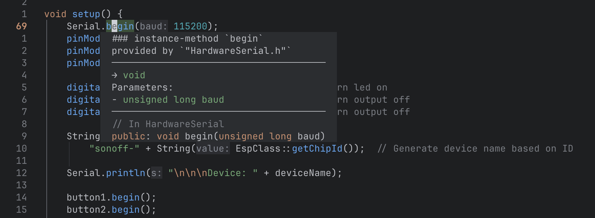

+++
date = '2025-04-04T20:58:04+02:00'
draft = false
title = 'Neovim and Platformio'
tags = ['neovim', 'platformio' ]
+++

Recently I've been a bit obcessed with Neovim and I was wondering if I could use it for my
Platformio projects. Of course, I could edit the source code with Neovim and the default Treesitter
plugin would provide syntax highlighting, but I wanted to go a bit further. Neovim has support for
LSP (Language Server Protocol) and with that, I could get autocompletion, linting, and other
features that would make my life easimr.

One of the LSP servers that I found is [clangd](https://clangd.llvm.org/config#compileflags), which
is a C/C++ language server. I had some trouble getting it to work, but I finally managed to get it
right. I just had to add a `extra_script.py` file to the project. This file is used to add some
extra configuration to the project. This file has to be referenced in `platformio.ini`, by adding
the following line to the file:

#### platformio.ini

```ini
extra_scripts = pre:extra_script.py
```

#### extra_script.py

```python
import os
Import("env")

env.Replace(COMPILATIONDB_INCLUDE_TOOLCHAIN=True)
env.Replace(COMPILATIONDB_PATH="compile_commands.json")
```

Now, when I run `pio run -t compile_commands`, it generates a file called `compile_commands.json`,
which tells clangd how to compile the source code. When I open a `.cpp` file in Neovim, it checks
the source code and I get autocompletion and linting. But unfortunately, there were a lot of errors,
so I did some more research. It turned out I could add a `.clangd` file to the project, which is
used to configure clangd.

I added some lines to disable/remove some compile flags and suppres some diagnostics errors, because
they were caused by some imported source files from libraries.

#### .clangd file:

```yaml
CompileFlags:
  Remove:
    - -fipa-pta
    - -mlongcalls
    - -free
    - -mtext-section-literals
    - -fno-tree-switch-conversion
    - -fstrict-volatile-bitfields
Diagnostics:
  Suppress:
    - redefinition_different_typedef
    - attribute_section_invalid_for_target
```

Now, most of the errors are gone, but there are still some errors that I couldn't solve. It turned
out that there was an [issue](https://github.com/platformio/platformio-core/issues/5090) in the
latest version of platformio. Clangd wasn't able to find any Arduino framework lib like: WiFi,
EEPROM, WiFiProv, etc, which caused errors like `Use of undeclared identifier 'WiFi'`. I had to
downgrade to version 6.1.16, which is the last version that didn't have this issue. I did that by
running the following command:

```bash
pipx install platformio==6.1.16
```

After that, I ran `pio update` to update the libraries and now everything was working smoothly.



## Formatting

Another thing I wanted to do was to format the code, which can be done with
[CLangFormat](https://clang.llvm.org/docs/ClangFormat.html). For that, I had to add a file called
`.clang-format` to the project. I based the configuration on the Google C++ Style Guide and added
some extra options to make this style more to my liking. I settled on the following configuration:

#### .clang-format

```yaml
---
Language: Cpp
BasedOnStyle: google
IndentWidth: 4
TabWidth: 4
ColumnLimit: 100
UseTab: Never
AlignArrayOfStructures: Left
BreakArrays: true
SpaceBeforeSquareBrackets: true
SpacesInContainerLiterals: true
AlignAfterOpenBracket: Align
Cpp11BracedListStyle: false
AlignConsecutiveAssignments: true
AlignConsecutiveMacros: true
---
```
